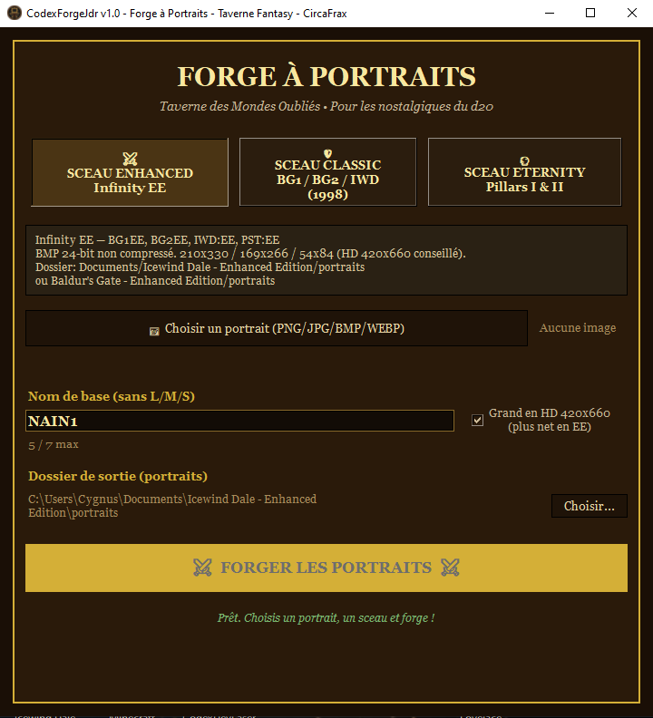

<p align="center">
  
</p>

# CodexForgeJdr v1.0.0

<p align="center">
  
</p>

<p align="center">

### ⬇️ [Télécharger CodexPdf v1.1.0 (Windows)](https://github.com/CircaFrax/CodexPdf/releases/download/v1.1.0/CodexPdf_v1.1.0.zip)

`SHA256: 2d5fd4a4fc9024916133203a63a2f1f04004298089f108c836c99d876998c056`

</p>

## Aperçu

*Sélection de l'univers – 100% offline*

### 📁 Structure

```
CodexForgeJdr/
├───CodexForgeJdr.exe
├───LICENCE.md
├───LICENSE.md
└───THIRD_PARTY_LICENSES.md
```

### 🔒 Confidentialité
- **Zéro réseau** : 100% offline.

### 📄 Licence
CircaFrax Proprietary Freeware

---
**Fait partie de la suite Codex** — des logiciels qui s'utilisent sans installation, comme en 1998, mais en mieux.


Forge à Portraits - Taverne Fantasy
Convertisseur de portraits offline pour les vieux CRPG. Un seul fichier HTML + une version logicielle fantasy.

Fonctionne 100% en local, aucune image n'est envoyée.

Sceaux supportés
⚔️ Sceau Enhanced - Infinity Engine Enhanced Edition : Baldur's Gate: Enhanced Edition, Baldur's Gate II: EE, Icewind Dale: EE, Planescape: Torment: EE
Format: BMP 24-bit 210x330 / 169x266 / 54x84 (HD 420x660 conseillé)
Dossier: Documents/Icewind Dale - Enhanced Edition/portraits ou Baldur's Gate - Enhanced Edition/portraits
🛡️ Sceau Classic - Infinity Engine Classic : Baldur's Gate, BG2, Icewind Dale (1998-2001)
Format: BMP L 110x170 24-bit + S 38x60 8-bit
Dossier: Jeu/portraits
🔮 Sceau Eternity - Pillars of Eternity I & II
Format: PNG 210x330 lg + 76x96 sm, nommés nom_lg.png / nom_sm.png
Dossier: PillarsOfEternity_Data/data/art/gui/portraits/player/male ou female
Utilisation Web via GitHub

Version EXE

# Pour l'EXE
Disclaimer / Marques
Baldur's Gate, Icewind Dale, Planescape: Torment, Neverwinter Nights sont des marques de Wizards of the Coast / Beamdog / Interplay.
Pillars of Eternity est une marque de Obsidian Entertainment / Xbox Game Studios.

Ce projet n'est pas affilié, approuvé ou sponsorisé par ces éditeurs. Il ne contient aucun asset de ces jeux, il ne fait que convertir vos propres images au bon format.

Licence CircaFrax - Voir LICENSE.

